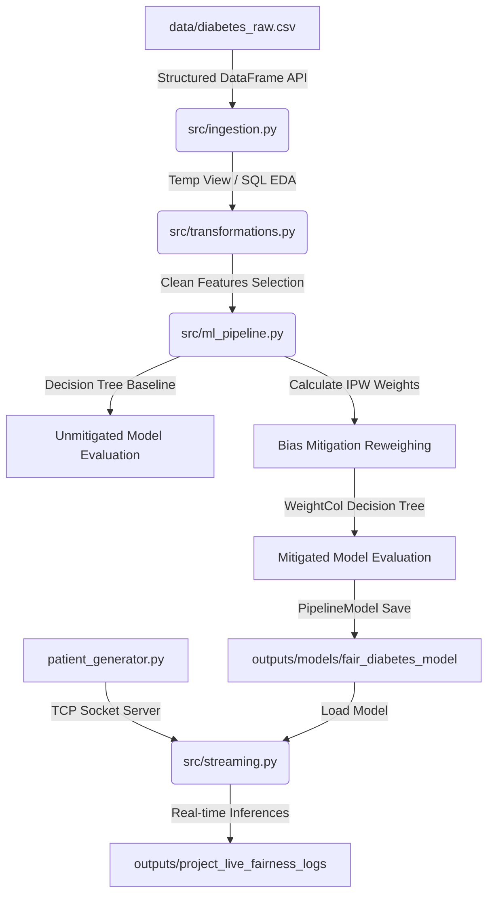

# Methodology - Algorithmic Fairness & Spark Pipeline Architecture

This project implements an end-to-end batch-and-streaming pipeline using Apache Spark to detect and mitigate algorithmic biases.

## 1. Algorithmic Fairness Framework & Context

There are three main criteria in the determination process:

### 1.1 Legal and Regulatory Frameworks (Protected Attributes)
In many traditional use cases (such as lending, housing, and hiring), sensitive features are dictated by anti-discrimination laws.
* Under frameworks like the US Civil Rights Act or the EU General Data Protection Regulation (GDPR), certain characteristics are designated as **"protected classes."**
* This is why datasets like `fetch_credit_card()` inherently label variables like **Sex, Race, and Age** as sensitive features. The law explicitly forbids using these attributes to deny people baseline opportunities.

### 1.2 The Type of Algorithmic Harm Being Assessed
The type of harm dictates what feature becomes "sensitive":
* **Allocation Harms:** Occur when an AI system unfairly extends or withholds opportunities, resources, or information.
  * *Example:* In `fetch_credit_card()`, **Age** and **Marriage Status** are designated as sensitive because a bank's model might unfairly withhold credit lines from younger or single applicants.
* **Quality of Service Harms:** Occur when an AI system simply works much better for one group of people than another, even if no money or resources are explicitly on the line.
  * *Example:* In a speech-to-text algorithm or facial recognition system, **Native Language Status** or skin tone (**Melanin Content**) would be determined as the sensitive features, because the technical performance of the model risks degrading for those specific sub-populations.

### 1.3 Contextual and Domain-Specific Vetting
Sometimes, a sensitive feature has nothing to do with demographics. It is determined purely by the domain context where the model is being deployed.
* In a healthcare setting (like Fairlearn's `fetch_diabetes_hospital()` dataset), features like **Insurance Type (Medicare/Medicaid)** or **Race** are designated as sensitive features.
* While insurance status is not an immutable demographic trait, an algorithm that unintentionally prioritizes commercially insured patients over Medicaid patients for hospital re-admission care would create a massive systemic inequality.

| Machine Learning Type | Fairness Instance | Case Details / Notes | Reference |
| :--- | :--- | :--- | :--- |
| **Regression** | Sickness Severity Score | <ul><li>To determine if individual may require care in future, a risk score was produced.</li><li>Observations showed that Black enrollees have higher rate of chronic illnesses than White enrollees of same score.</li><li>Algorithm used health costs as proxy for health.</li></ul> | Obermeyer, Ziad, Brian Powers, Christine Vogeli, and Sendhil Mullainathan. "Dissecting racial bias in an algorithm used to manage the health of populations." Science 366, no. 6464 (2019). / doi:10.1126/science.aax2342. |
| **Classification** | Credit Worthiness | <ul><li>To determine if applicant may default, a probability score was used.</li><li>“In default”: failed to pay a debt for longer than 90 days in more than one account over 18-24 month period.</li><li>Use equalized odds to enforce accuracy is equal in all groups.</li></ul> | Hardt, M., Price, E., & Srebro, N. (2016). Equality of opportunity in supervised learning. arXiv. https://doi.org/10.48550/arXiv.1610.02413 |
| **Ranking** | Job Ranking | <ul><li>Ranked lists produced by biased model can amplify bias.</li><li>Without fairness intervention, top ranked results can be skewed with respect to sensitive attributes.</li><li>To mitigate, fair re-ranking algorithms are required (e.g., score maximizing greedy mitigation).</li></ul> | Geyik, Sahin Cem, Stuart Ambler, and Krishnaram Kenthapadi. "Fairness-Aware Ranking in Search & Recommendation Systems with Application to LinkedIn Talent Search." Proceedings of the 25th ACM SIGKDD International Conference on Knowledge Discovery & Data Mining (KDD) (2019). / arXiv:1905.01989. |
| **Recommendation** | Targeted Advertising | <ul><li>Recommendations produced by biased models may amplify bias.</li><li>Experiment: Different ad settings led to different frequency of high paying jobs shown.</li><li>Require multi-sided fairness or sequential recommendations.</li></ul> | Pitoura, E., Stefanidis, K., & Koutrika, G. (2021). Fairness in rankings and recommendations: An overview. arXiv. https://doi.org/10.48550/arXiv.2104.05994 |
| **Clustering** | Fair Hiring | <ul><li>Cluster resumes for shortlist in a hiring scenario.</li><li>Callback rates may differ per group (incorporate fairness constraints in optimization).</li><li>Aim for proportional representation of the sensitive class per cluster.</li></ul> | Abraham, Savitha Sam, Deepak P., and Sanil V. "Fairness in Clustering with Multiple Sensitive Attributes." Proceedings of the 23rd International Conference on Extending Database Technology (EDBT) (2020). / arXiv:1910.05113. |
| **Anomaly Detection** | Government Relief Fund | <ul><li>Small fraction of COVID relief direct payments experience fraud.</li><li>Scale of money allocation makes traditional tracking impossible.</li><li>Outliers should not be skewed towards a particular group.</li></ul> | Deepak, P., and Savitha Sam Abraham. "FairLOF: Fairness in Outlier Detection." Applied Intelligence 51, no. 12 (2021). / doi:10.1007/s41019-021-00169-x. |

## 2. Spark Pipeline Architecture

## 3. Algorithmic Fairness: Bias Mitigation via Reweighing

To mitigate disparities in selection and false negative rates across demographic groups, we apply **Sample Reweighing** (a preprocessing/in-processing mathematical intervention). 

### Inverse Probability Weighting (IPW) Formula
The weight $W$ for a patient with label $Y$ (readmission status) and sensitive attribute value $A$ (race group) is computed as:

$$W(Y, A) = \frac{P(Y) \times P(A)}{P(Y, A)}$$

Where:
* $P(Y)$ is the historical baseline probability of label $Y$.
* $P(A)$ is the baseline probability of sensitive group $A$.
* $P(Y, A)$ is the joint probability of label $Y$ and group $A$.

Applying these weights during training forces the decision boundary of the MLlib classifier to treat demographic cohorts with equal importance, effectively breaking the correlation between demographic attributes and prediction outcomes.

## 4. Spark Performance Optimizations

1. **Broadcast Join Optimization**: The calculated weights lookup table (`weights_lookup`) contains only a few rows (one for each combination of label and sensitive class). Rather than executing a standard shuffle-based join on the massive training dataset, we wrap it in `F.broadcast()`, transmitting the tiny lookup table to all Spark executors directly.
2. **Caching Optimization**: We apply `.cache()` on the training DataFrame (`train_data_weighted`) since it is referenced multiple times during iterative tree building and metrics computation, avoiding redundant re-evaluations.
