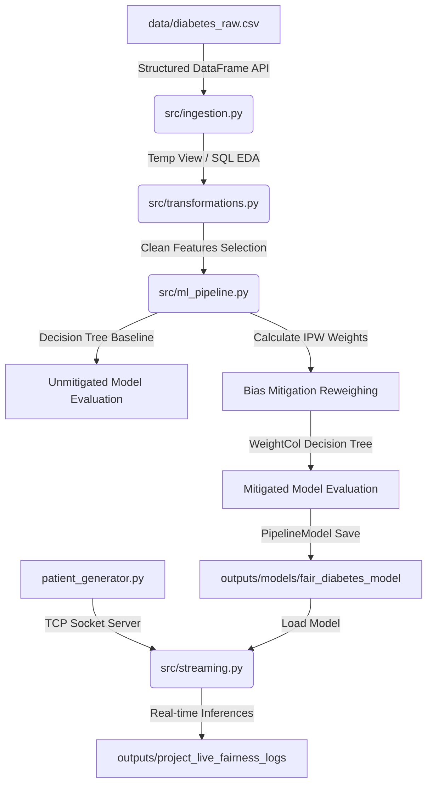

# Methodology 

This project implements an end-to-end batch-and-streaming pipeline using Apache Spark to detect and mitigate algorithmic biases.

## 1. Spark Pipeline Architecture

## 2. Algorithmic Fairness: Bias Mitigation via Reweighing

To mitigate disparities in selection and false negative rates across demographic groups, we apply **Sample Reweighing** (a preprocessing/in-processing mathematical intervention). 

### Inverse Probability Weighting (IPW) Formula
The weight $W$ for a patient with label $Y$ (readmission status) and sensitive attribute value $A$ (race group) is computed as:

$$W(Y, A) = \frac{P(Y) \times P(A)}{P(Y, A)}$$

Where:
* $P(Y)$ is the historical baseline probability of label $Y$.
* $P(A)$ is the baseline probability of sensitive group $A$.
* $P(Y, A)$ is the joint probability of label $Y$ and group $A$.

Applying these weights during training forces the decision boundary of the MLlib classifier to treat demographic cohorts with equal importance, effectively breaking the correlation between demographic attributes and prediction outcomes.

## 3. Spark Performance Optimizations

1. **Broadcast Join Optimization**: The calculated weights lookup table (`weights_lookup`) contains only a few rows (one for each combination of label and sensitive class). Rather than executing a standard shuffle-based join on the massive training dataset, we wrap it in `F.broadcast()`, transmitting the tiny lookup table to all Spark executors directly.
2. **Caching Optimization**: We apply `.cache()` on the training DataFrame (`train_data_weighted`) since it is referenced multiple times during iterative tree building and metrics computation, avoiding redundant re-evaluations.

[Return to Documentation Guide](./README-documentation.md)
